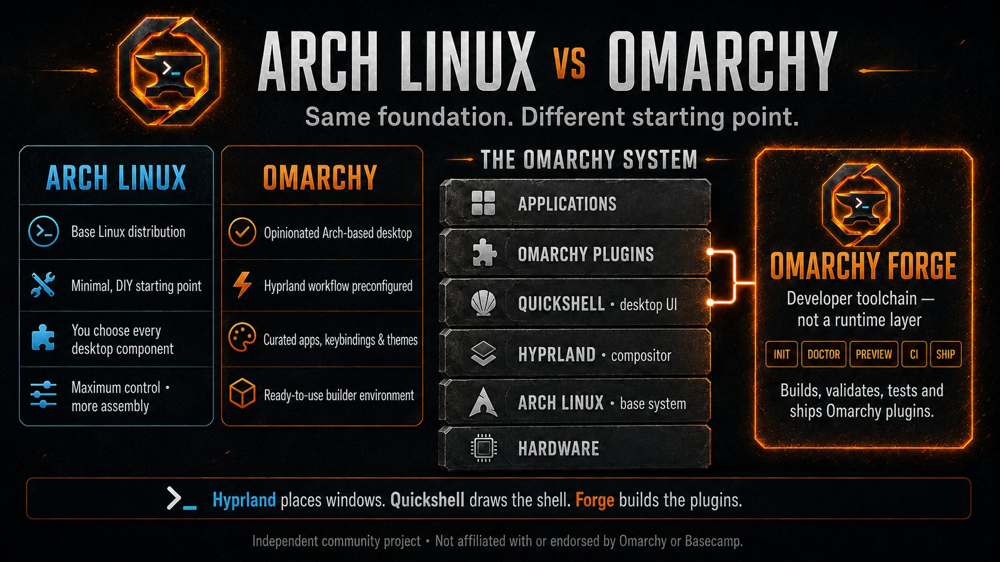

# Omarchy Forge

Developer tools for building, testing, and shipping Omarchy plugins.

> Omarchy Forge is an independent community project. It is not affiliated with
> or endorsed by Omarchy, Basecamp, 37signals, or DHH.

Omarchy Forge is in early development. Its first working artifact is a safe,
deterministic scaffold for an Omarchy bar widget with a popout. Generated
projects complement the official `omarchy plugin validate` command rather than
replacing it.



_Forge builds tooling around the Omarchy plugin layer; it is not part of the
desktop runtime. The workflow labels illustrate the product direction—see the
[roadmap](docs/ROADMAP.md) for what is currently implemented._

## Build your first plugin

Forge runs on the Linux machine where Omarchy is installed. If you normally use
Windows or macOS, open a terminal **inside Omarchy** before continuing. You do
not need Go, `sudo`, or prior Linux development experience to use the release.

### 1. Install Forge

Copy this entire block into the Omarchy terminal. It detects the machine's CPU,
downloads the matching Forge `v0.3.0` release, verifies its checksum, and
installs it for your user only:

```bash
(
  set -eu
  version="0.3.0"
  case "$(uname -m)" in
    x86_64) arch="amd64" ;;
    aarch64|arm64) arch="arm64" ;;
    *) echo "Unsupported CPU: $(uname -m)" >&2; exit 1 ;;
  esac
  install_tmp="$(mktemp -d)"
  trap 'rm -rf -- "$install_tmp"' EXIT
  cd "$install_tmp"
  curl -fLO "https://github.com/omarchy-forge/forge/releases/download/v${version}/omaforge_${version}_linux_${arch}.tar.gz"
  curl -fLO "https://github.com/omarchy-forge/forge/releases/download/v${version}/checksums.txt"
  sha256sum --ignore-missing --check checksums.txt
  tar -xzf "omaforge_${version}_linux_${arch}.tar.gz"
  install -Dm755 omaforge "$HOME/.local/bin/omaforge"
  "$HOME/.local/bin/omaforge" version
)
cd "$HOME"
```

This changes only `~/.local/bin/omaforge`, removes its temporary download
directory, and returns the terminal to your home directory. If `omaforge` is
not found in a new terminal, use `$HOME/.local/bin/omaforge` or add
`~/.local/bin` to your `PATH`.

### 2. Create a plugin

```bash
cd "$HOME"
omaforge init project-pulse --git
```

Forge asks for the remaining information. For the plugin ID, use a unique
reverse-domain value such as `dev.yourname.project-pulse`.

### 3. Check your project

```bash
cd "$HOME/project-pulse"
omaforge check .
omaforge doctor .
omarchy plugin validate .
```

`check` does not execute plugin QML. `doctor` performs read-only checks of your
local environment. The final command is Omarchy's official validator.

### 4. Preview it safely

Review the generated QML first, then acknowledge that local QML execution is
trusted:

```bash
omaforge dev . --trust-plugin-code --state ready
omaforge dev . --trust-plugin-code --state empty
omaforge dev . --trust-plugin-code --state error
omaforge dev . --trust-plugin-code --state ready --watch
```

These commands use an isolated temporary runtime. They do not install the
plugin, edit Omarchy configuration, or connect to the live shell. Stop watch
mode with `Ctrl-C`.

### 5. Try it in Omarchy

Plugins execute unsandboxed inside the long-running Omarchy Shell process. Only
enable code you have reviewed:

```bash
omarchy plugin add "$PWD" --enable
./demo/run empty
```

When testing is complete, remove it with the plugin ID entered during creation:

```bash
omarchy plugin remove dev.yourname.project-pulse
```

### 6. Capture a preview image

```bash
omaforge screenshot . \
  --trust-plugin-code \
  --state ready \
  --output assets/preview.png
```

Forge captures only the plugin-declared panel content, never the desktop, and
refuses to overwrite an existing file.

For more detail, see the
[complete Quickstart](https://www.omarchyforge.com/docs/quickstart),
[command reference](https://www.omarchyforge.com/docs/commands), and
[plugin anatomy guide](https://www.omarchyforge.com/docs/plugin-anatomy).

## Build with your Omarchy AI agent

Forge `v0.3.0` includes opt-in agent-ready scaffolding. Add `--agent-ready` when
creating a project:

```bash
omaforge init project-pulse --git --agent-ready
cd project-pulse
```

This adds two deterministic files without contacting an AI service:

- `FORGE_SPEC.md` turns the plugin idea into explicit UI, data, state, privacy,
  failure, timeout, and acceptance requirements.
- `AGENTS.md` restricts an agent to the project, preserves Forge contracts, and
  prohibits installation, privileged operations, and QML execution.

Replace every placeholder answer in `FORGE_SPEC.md`, review both files, change
its status from `Draft` to `Ready for implementation`, and commit the completed
specification as a rollback point before starting an agent. Omarchy can then
hand the task to the user's configured agent:

```bash
omarchy agent prompt \
  "Build the plugin described in FORGE_SPEC.md. Follow AGENTS.md exactly."
```

Omarchy may launch prompt tasks unattended, so use this only after reviewing
the specification and committing a rollback point. The agent may edit code and
run static validation; the user must still review the diff and explicitly
decide whether to run `omaforge dev` or install the plugin.

This workflow has been verified end to end with the released `v0.3.0` binary:
Forge generated a disposable agent-ready project, a human completed and
committed its specification, and Omarchy's configured agent implemented a
scoped local Git-status widget. The generated tests, `omaforge check`, and the
official Omarchy validator passed without executing QML, installing the plugin,
or changing live shell configuration. Human diff review still caught and fixed
an invalid NUL byte. The follow-up checker fix is merged into Forge `main` as
error rule `OF305` and will be included in the next release; the installed
`v0.3.0` checker does not contain that rule. The trial validates the guarded
workflow, not automatic trust in agent-written code.

## Check an existing plugin

Forge checks are deterministic, local, and do not execute plugin QML or use the
network:

```bash
omaforge check .
omaforge check . --format json
omaforge check . --format sarif
```

Findings identify whether a rule mirrors the inspected official validator or
is a Forge quality rule. Exit code 0 means no error-severity findings, 1 means
the project has errors, and 2 means command usage is invalid. Warnings are
reported without failing the check.

## GitHub Action and releases

The repository contains a composite check Action and a tag-driven Linux release
pipeline. The Action downloads an exact release version, verifies its checksum,
and emits pull-request annotations. Forge and its release assets are public;
Handoff remains a separate private project. See the
[Action guide](action/README.md) and [release process](docs/RELEASING.md).

## Documentation website

The documentation website is live at
[www.omarchyforge.com](https://www.omarchyforge.com). Its
source lives in `website/` and covers the homepage, quickstart,
templates, commands, plugin anatomy, manifest, compatibility, roadmap, and
contributing guides. It uses a static-first Next.js/MDX architecture without AI
chat, analytics, tracking, accounts, authentication, or a database.

```bash
cd website
corepack enable
pnpm install --frozen-lockfile
pnpm typecheck
pnpm build
```

Vercel serves `www.omarchyforge.com` as the canonical origin, with the apex
domain redirecting to it.

## Build Forge from source

This section is for Forge contributors. Go 1.23 or newer is required to build
the CLI from source; ordinary plugin authors can use the release above.

```bash
go build -o ./tmp/omaforge ./cmd/omaforge
./tmp/omaforge --help
./tmp/omaforge version
./tmp/omaforge check .
```

## Development

Run the same baseline checks used by CI:

```bash
test -z "$(gofmt -l .)"
go test ./...
go vet ./...
go build ./cmd/omaforge
```

See [the product definition](docs/PRODUCT.md), [roadmap](docs/ROADMAP.md),
[rule reference](docs/RULES.md), and [contribution guide](CONTRIBUTING.md) for
the current scope.

## License

Omarchy Forge is licensed under the [MIT License](LICENSE).
